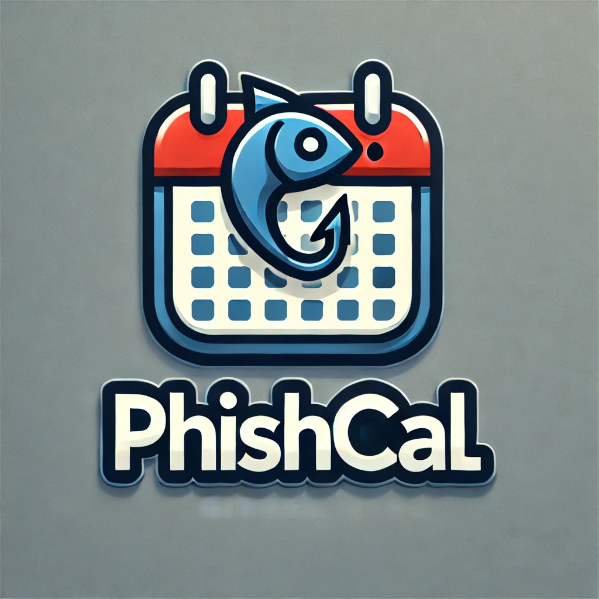

# PhishCal

<p align="center">
 
</p>

## Introduction 
PhishCal is a Python-based tool to generate .ICS phishing files, allowing you to send malicious calendar invites as part of penetration testing and red team operations.

- Create .ICS phishing files with custom event details.
- Automate sending malicious calendar invites via SMTP.
- Template-based tool

## Installation
```bash
# Clone the repository
git clone https://github.com/yourusername/PhishCal.git
cd PhishCal

# Install dependencies
pip install -r requirements.txt
```

## Usage
The tool can be run via the command line with the following options:
```bash
python3 PhishCal.py -t <template> -u <username> -p <password> -s <smtp_server> --sender <attacker_email> --target <target_email>
```

## Disclaimer
This tool is intended for educational purposes and authorized penetration testing only. Unauthorized use of this tool is prohibited and may violate laws and ethics.